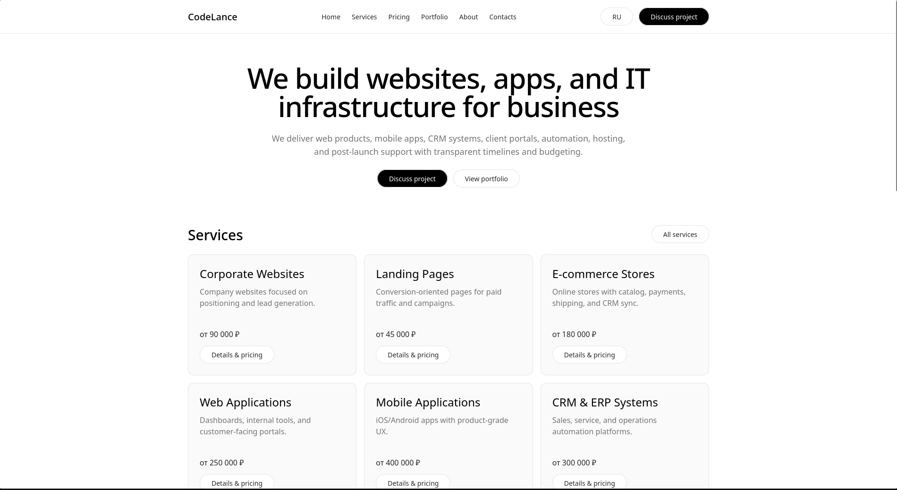
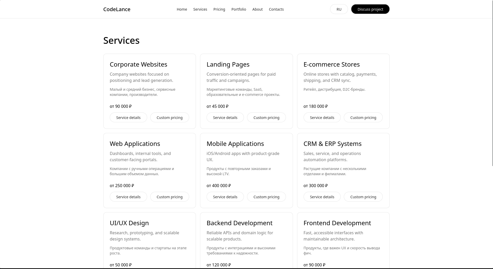
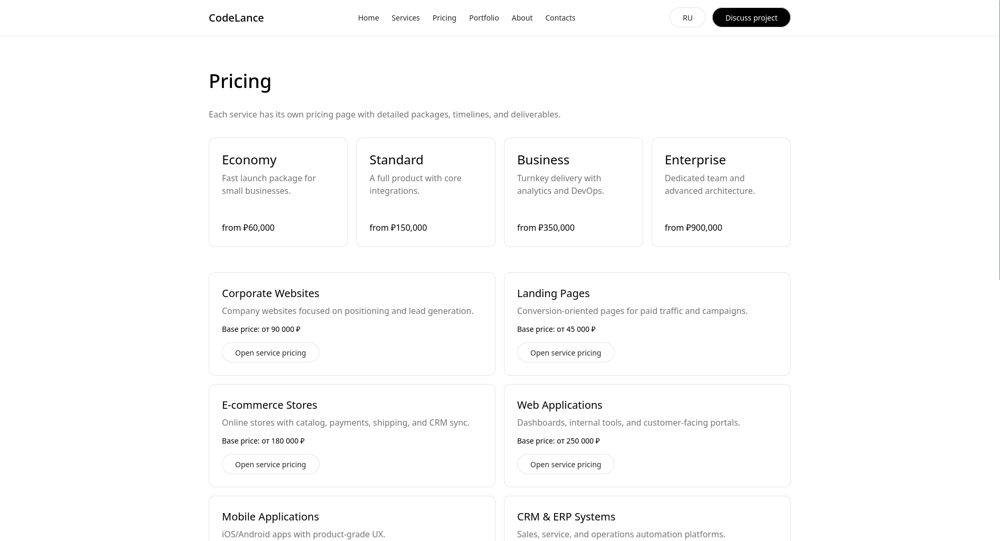
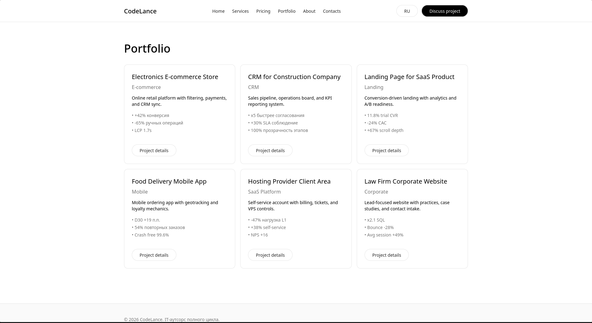
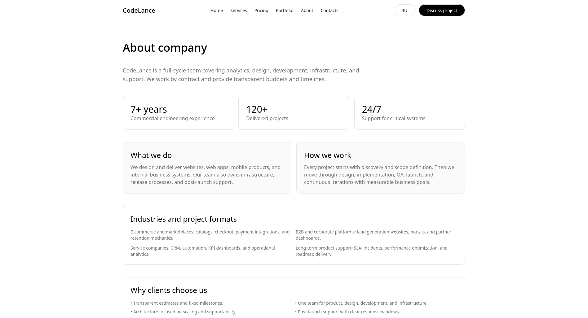
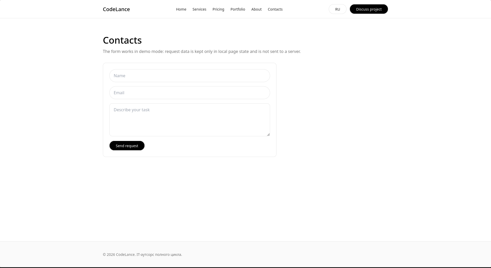
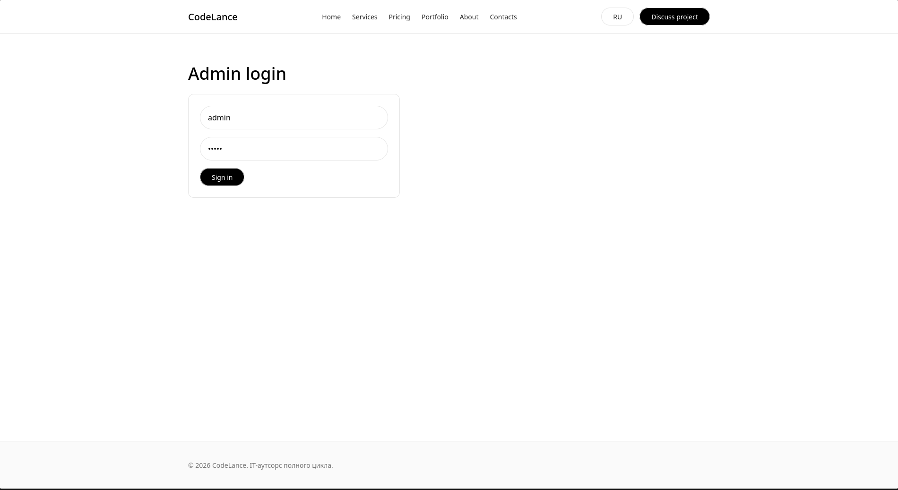
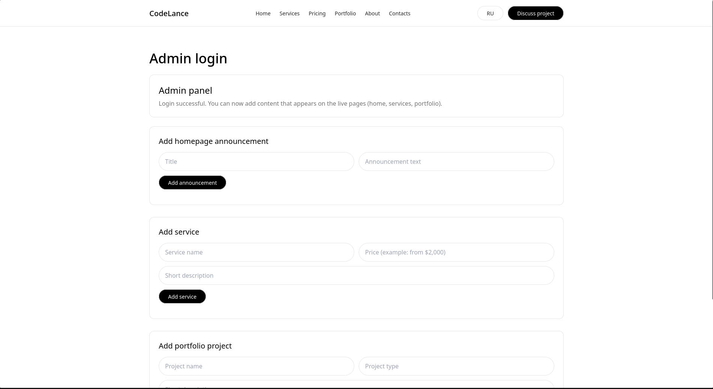

# CodeLance

Многостраничный демо-сайт IT-аутсорс компании с портфолио, страницами услуг, индивидуальным прайсингом, контактной формой (без реальной отправки) и скрытой админ-страницей для локального управления контентом.

## Что реализовано

- Главная страница с секциями услуг, тарифов и портфолио.
- Отдельные страницы:
  - `/services`
  - `/pricing`
  - `/portfolio`
  - `/about`
  - `/contacts`
- Динамические страницы:
  - `/services/[slug]` — подробная страница услуги
  - `/pricing/[slug]` — индивидуальные пакеты и сроки по услуге
  - `/portfolio/[slug]` — подробный кейс
- Скрытая админ-панель:
  - `/admin` (в навигации не отображается)
  - логин/пароль: `admin / admin`
  - данные хранятся в `localStorage` (демо-режим, без backend)
- Переключение языка EN/RU через cookie.

## Технологии

- **Next.js 14** (App Router)
- **TypeScript**
- **Tailwind CSS**
- **ESLint**

## Структура проекта

```text
app/                  # страницы и маршруты Next.js
components/           # переиспользуемые компоненты
components/admin/     # компоненты админки
components/content/   # блоки контента из localStorage
data/                 # статические данные сайта
hooks/                # клиентские хуки
lib/                  # утилиты и i18n
docs/screenshots/     # локальные скриншоты (добавляются вручную)
```

## Быстрый старт (локальный запуск)

### 1) Требования

- Node.js 18.18+ (рекомендовано 20+)
- pnpm 9+

Проверка:

```bash
node -v
pnpm -v
```

### 2) Установка зависимостей

```bash
pnpm install
```

### 3) Запуск dev-сервера

```bash
pnpm dev
```

После запуска сайт доступен на:

- `http://localhost:3000`

### 4) Полезные команды

```bash
pnpm dev         # локальная разработка
pnpm build       # production-сборка
pnpm start       # запуск production-сборки
pnpm lint        # eslint
pnpm typecheck   # TypeScript проверка
```

## Админ-доступ

- URL: `http://localhost:3000/admin`
- Логин: `admin`
- Пароль: `admin`

> Важно: это демо-авторизация для локального сценария. Данные не защищены серверной сессией и не предназначены для production.

## Контактная форма

Форма на `/contacts` работает в демонстрационном режиме: заявка не отправляется на внешний backend и используется только для UI-сценария.

## Фавикон (из docs/screenshots)

В проект добавлен endpoint фавикона `/api/favicon`, который читает файл:

- `docs/screenshots/favicon.png`

Чтобы фавикон появился, просто положите ваш PNG-файл по этому пути.

## Скриншоты

Ниже локальные ссылки на скриншоты (можно заполнить своими файлами):

##Главная


##Услуги


##Цены


##Портфолио


##О компании


##Контакты


##Админ-панель


##Админ-панель


## Частые проблемы

- Ошибка `next: not found` или `Cannot find module 'next/*'`:
  - не установлены зависимости, выполните `pnpm install`.
- Проблемы с запуском после смены версии Node.js:
  - удалите `node_modules` и lock-файл, затем установите зависимости заново.
